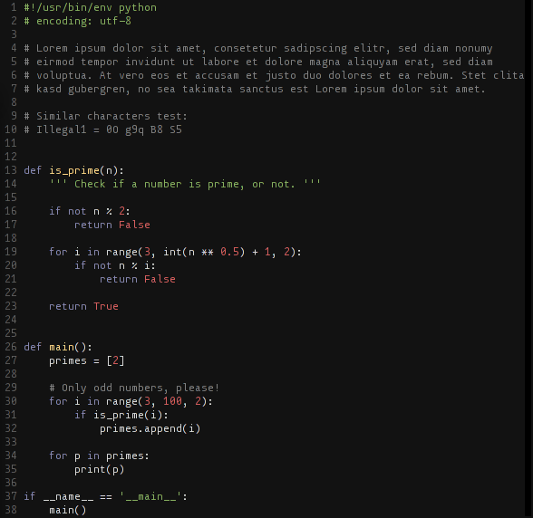

monoOne
=======

monoOne is a monospaced font for programming and code review. 

##how does it look?
[specimen (pdf)](specimen/monoOneSpecimen.pdf)

example (screenshot taken with linux/vim)

##installation
[download](monoOne.otf)
* [OS X](http://support.apple.com/kb/HT2509)
* [Windows](http://windows.microsoft.com/en-us/windows-vista/install-or-uninstall-fonts)
* Linux/Unix - distro dependent, i hope you know how to install it

##about
It all started with the search for a better programming font. I tried nearly every suitable monospace typeface, but i couldn't find the optimal solution, at least not for me. So it slowly became a small, personal research-project, exploring the typographic needs of code display. I started the development with following functional specifications:

* _monospaced_: this is the default for nearly all programming environments, but there are some discussion if this specific feature is just historic ballast, while the pro-monospace side is arguing that the possibility of lining up code and the resulting 2-dimensional structuring is useful. I think this is just an minor argument, but a more substantial reason is that in code, every character has potentially the same significance and should be given the same space to represent that. Give every character the same amount of space emphases reading on the character level and makes it easier to spot mistakes. Additionally it is a simple convention through all coding environments - the coder can be sure that her code will look similar for other programmers, even if they use another editor and typeface. 
* _must work well on low and high resolution displays_: Right now we are in the transition to high resolution displays, bringing font rendering quality on screen in the realms of print. But we're not there yet, and especially on cheap laptops and typical office-displays we won't be there in the foreseeable future. So the glyphs must survive being squashed into a grid of a few pixels extremely well, but they should be designed with attention to detail, even when it's only visible in print or on retina displays. 
* _differentiation of characters_: every character must not be mistaken for a similar looking character. While this seems obvious it comes with costs, like inferior long-text readability and less consistent appearance. I want to reach this goal with minimal tradeoffs. 
* _visual representation of the coding mindset_: Coding is the expressions of ideas in a computer readable form. These ideas should be clear and condensed. The typeface that makes the code visible should reinforce this values. It should look clutter-free and open.
This is arguable the least technical demand, and the hardest to capture. Considerations regarding this point never beats the previous specifications, but every decision must be evaluated under this aspect. 

##a closer look
The diagonal forms are inspired by various pixel fonts. This leads to better low resolution rendering, but also gave me the opportunity to induce a nice retro-touch without being to upfront with it. 

Over the time of the development the design became more and more simplicstic while some unusual features emerged. For example the serifs on the "D" and "B" where very useful to distinguish it clearly from "O" and "8". The form of the white spaces helps differentiate the more dense characters like "M", "N" and "Z". Similar looking characters like "i", "1", "!", "I" and "l" were constructed with clearly different principles so that they are distinct even under the worst conditions. 

The special characters seem exaggerated, but are identifiable in all point sizes and circumstances. 
The font is created with a mathematical descriptions of the pure skeleton and a algorithm that creates the strokes. Every parameter like the weight, x-height, overshoot etc. can be manipulated through code, so i could fine-tune all the parameters without restarting drawing. 

monoOne has a over 300 characters, including the [powerline](https://github.com/Lokaltog/powerline) symbols. 
